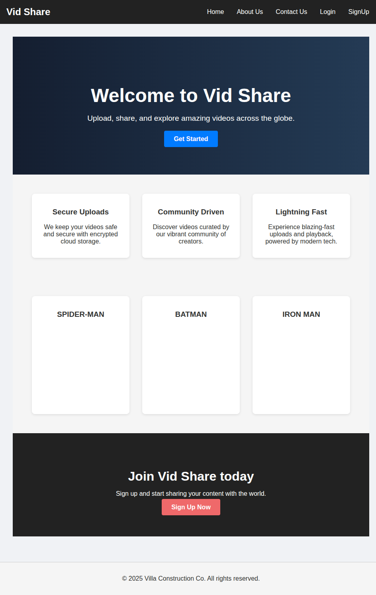
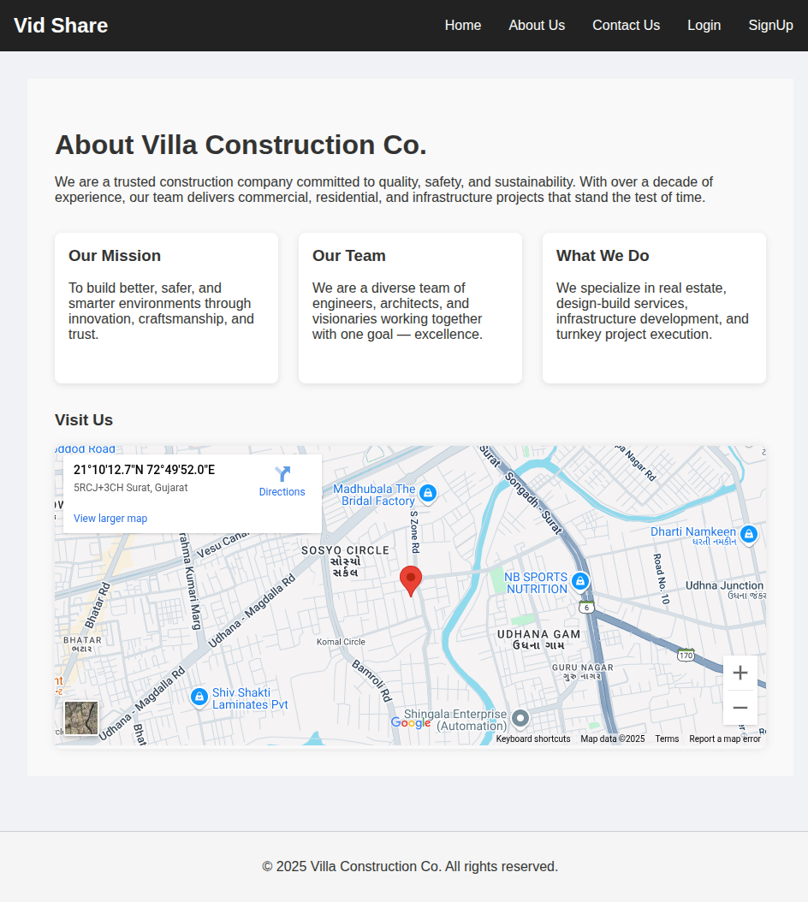
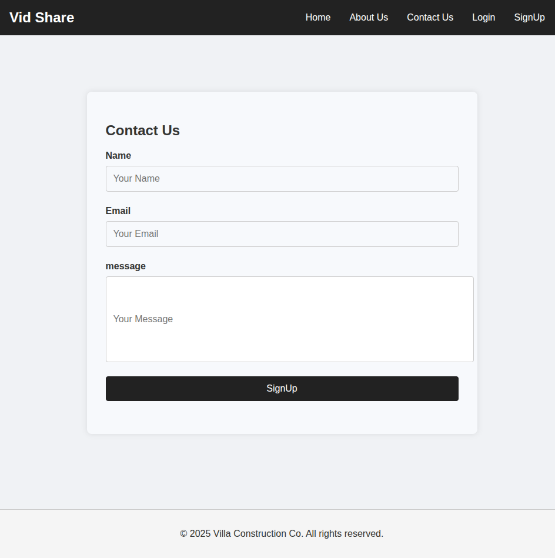
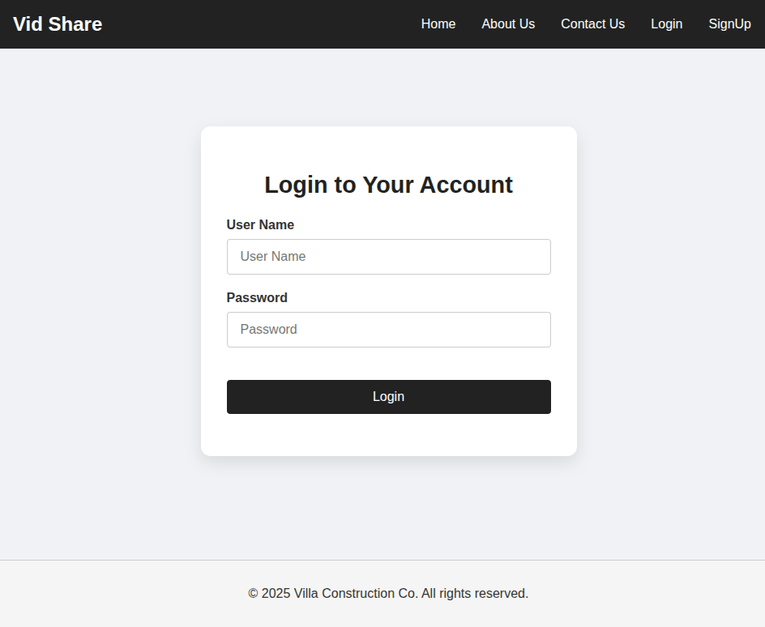

# 🏗️ Villa Construction Portal

A modern Flask-based web portal for video sharing, contact messaging, and secure user authentication with reCAPTCHA protection.

---

## 🌐 Features

- 🔐 Login & Signup (with reCAPTCHA)
- 📨 Contact form with DB storage and email notifications
- 📍 Embedded Google Map
- 🎥 Embedded video sections
- 📁 Modern UI with custom CSS

---

## 🏠 Home



---

## ℹ️ About Us



---

## 📬 Contact Us



---

## 🔑 Login



---

## 🆕 SignUp


---

## ⚙️ Tech Stack

- **Flask** (backend)
- **Flask-WTF** (form handling with reCAPTCHA)
- **Flask-SQLAlchemy** (ORM)
- **WTForms** (form validation)
- **SQLite** (database)
- **HTML/CSS/JS** (frontend)

---

## 🚀 How to Run

```bash
# Clone this repository
git clone https://github.com/yourusername/villa-portal.git
cd villa-portal

# Setup virtual environment
python3 -m venv venv
source venv/bin/activate

# Install dependencies
pip install -r requirements.txt

# Run the app
python app.py
```